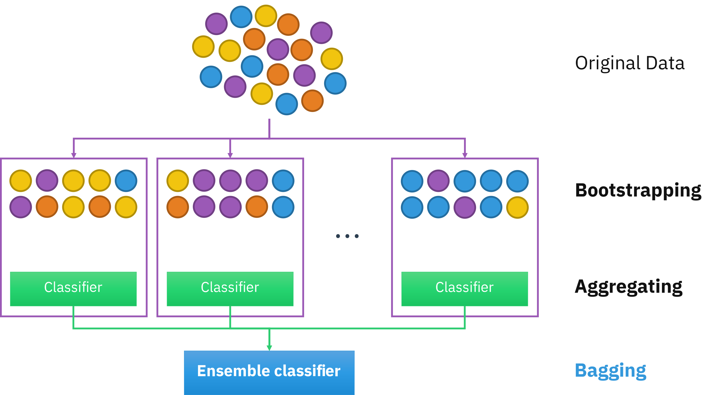
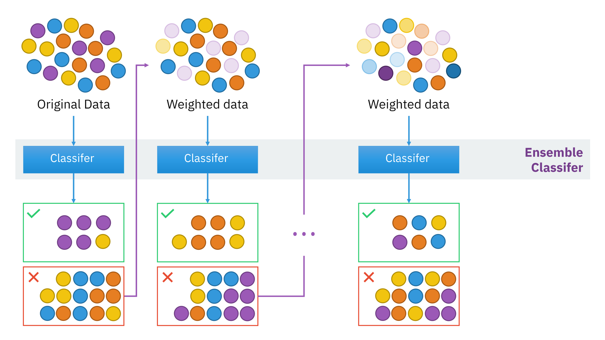

# Personal Project Overview

**GOAL:** to explore key features which impact the success of a Formula 1 race.

**METHOD 1**: Decision tree, Random Forest, Logistic Regression, Bagging/Boosting to predict 'WON_RACE' for 1st, 2nd, 3rd place qualifiers

**METHOD 2**: Logistic Regression to predict likelihood of 1st place qualifier winning for top 5 raced tracks

**METHOD 3** Decision tree, Random Forest, Logistic Regression, Bagging/Boosting to predict 'WON_RACE' for 1st, 2nd, 3rd, place qualifiers *with* pit stop and safety car information

------------------------------------------------------------------------

# Algorithm Overview

## Logistic Regression

-   The Formula of logistic regression is given:

$$\begin{align} Ρ = \frac{\mathrm{e}^{a+bX}}{1+\mathrm{e}^{a+bX}}. \end{align}$$

-   Used to obtain odds ratio in the presence of more than one explanatory variable

## Recursive Binary Splitting

-   Suppose we have some series:

$$\\begin{align} S(a,b) = \\sum\_{n=a}^b \\frac{p_n}{q_n} \\end{align}$$

-   Then the goal is to find integers P(a,b) and Q(a,b) such that:

$$\\begin{align} S(a,b) = \\sum\_{n=a}^b \\frac{P(a,b)}{Q(a,b)} \\end{align}$$

## Random Forest

-   We use the Mean Square Error (MSE) to find how far data branches from each node:
    -   where $f_i$ is the value returned by the model
    -   $y_i$ is the actual value for data point i.
    -   $N$ is the number of data points.

$$\\begin{align} MSE = \\frac{1}{N}\\sum\_{i=1}^N (f_i - y_i)^2 \\end{align}$$

-   This is a classification problem, thus we use a method of measurement known as the gini impurity and entropy.
    -   Where $p_i$ represents the relative frequency of the class you are observing in the data set and $c$ represents the number of classes.

$$\\begin{align} Gini = 1 - \\sum\_{i=1}^N (p_i)^2 \\end{align}$$

$$\\begin{align} Entropy = \\sum\_{i=1}^C -p_i \* log_2(p_i) \\end{align}$$

## Bagging Algorithms

Three steps to bagging:

1.  **Bootstrapping:**  Bagging leverages a bootstrapping sampling technique to create diverse samples. This resampling method generates different subsets of the training dataset by selecting data points at random and with replacement. This means that each time you select a data point from the training dataset, you are able to select the same instance multiple times. As a result, a value/instance repeated twice (or more) in a sample.

2.  **Parallel training:** These bootstrap samples are then trained independently and in parallel with each other using weak or base learners.

3.  **Aggregation:** Finally, depending on the task (i.e. regression or classification), an average or a majority of the predictions are taken to compute a more accurate estimate. In the case of regression, an average is taken of all the outputs predicted by the individual classifiers; this is known as soft voting. For classification problems, the class with the highest majority of votes is accepted; this is known as hard voting or majority voting.

## Boosting Algorithms

**End goal of Boosting**: to convert a weak learning algorithm into a stronger algorithm for better predictions. General steps of a boosting algorithm:

1.  The base learner takes all the distributions and assign equal weight or attention to each observation.

2.  If there is any prediction error caused by first base learning algorithm, then we pay higher attention to observations having prediction error.

    1.  Then, apply the next base algorithm.

3.  We repeat (2) until a desired accuracy is achieved.

# Machine Learning Overview

Machine learning (ML) refers to a system's ability to acquire, and integrate knowledge through large-scale observations, and to improve, and extend itself by learning new knowledge rather than by being programmed with that knowledge.

It is a large step away from "if x, do y."

Key definitions include:

-   **Dataset:** A set of data examples, that contain features important to solving the problem.

-   **Features:** Important pieces of data that help us understand a problem. These are fed in to a Machine Learning algorithm to help it learn.

-   **Model:** The representation of some phenomenon that a Machine Learning algorithm has learnt. In order for many to learn, they must train, meaning data is split. Part of the data is used to teach the algorithm, while the remaining data is used to test the algorithm for predictions.

The general process for developing a machine learning algorithm is:

1.  **Data Collection:** Collect the data that the algorithm will learn from.

2.  **Data Preparation:** Format and engineer the data into the optimal format, extracting important features and performing dimensionality reduction.

3.  **Training**: Also known as the fitting stage, this is where the Machine Learning algorithm actually learns by showing it the data that has been collected and prepared.

4.  **Evaluation**: Test the model to see how well it performs.

5.  **Tuning**: Fine tune the model to maximise it’s performance.

# Machine Learning with Oracle (OML)
